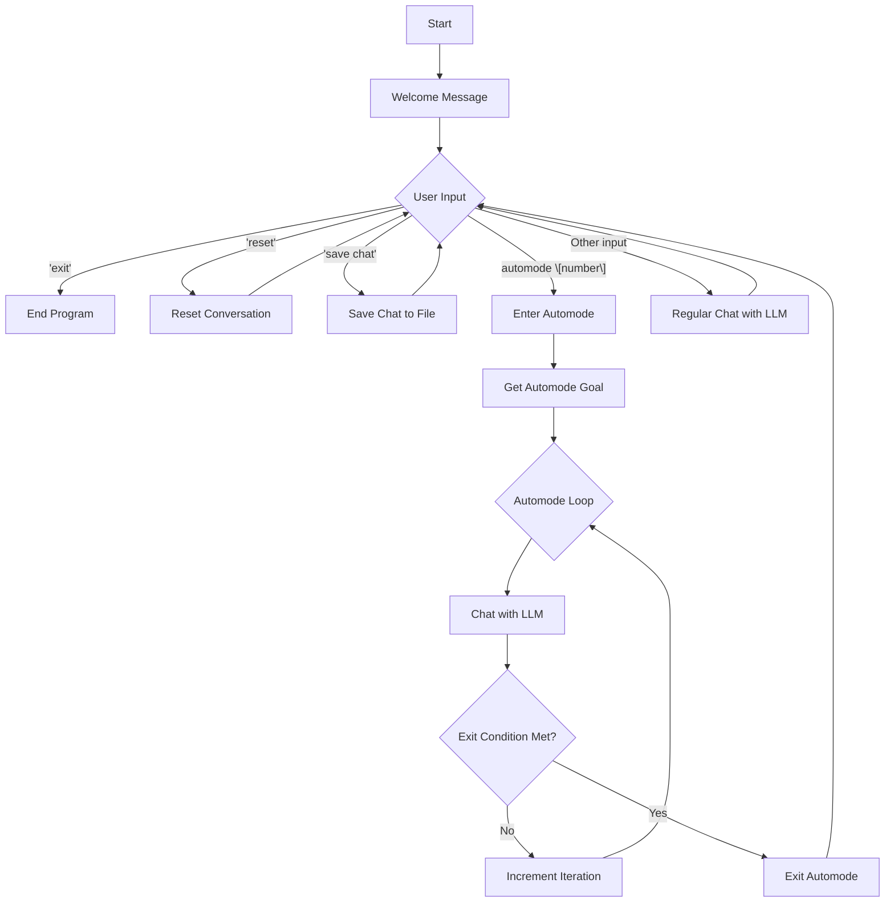
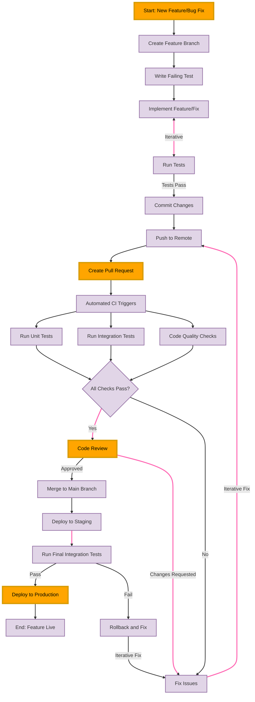

# 🤖 LLM Engineer

LLM Engineer is an advanced interactive command-line interface (CLI) that harnesses the power of various large language models to assist with a wide range of software development tasks. This project is forked from [Claude Engineer](https://github.com/Doriandarko/claude-engineer) and extends its capabilities by leveraging [LiteLLM](https://docs.litellm.ai/) to allow it to work with 100+ LLMs, including Anthropic's models.

## ✨ Features

- 💬 Interactive chat interface with support for 100+ LLMs, including Anthropic's Claude models
- 📁 Comprehensive file system operations (create folders, files, read/write files)
- 🔍 Web search capabilities using Tavily API for up-to-date information
- 🌈 Enhanced syntax highlighting for code snippets
- 🏗️ Intelligent project structure creation and management
- 🧐 Advanced code analysis and improvement suggestions
- 🚀 Improved automode for efficient autonomous task completion
- 🔄 Robust iteration tracking and management in automode
- 📊 Precise diff-based file editing for controlled code modifications
- 🛡️ Enhanced error handling and detailed output for tool usage
- 🎨 Color-coded terminal output using Rich library for improved readability
- 🔧 Detailed logging of tool usage and results
- 🔁 Improved file editing workflow with separate read and apply steps
- 🧠 Dynamic system prompt updates based on automode status
- 💾 Chat log saving capability

## 🛠️ Installation and Quickstart

1. Clone this repository:
   ```
   git clone https://github.com/akari2600/llm-engineer.git
   cd llm-engineer
   ```

2. Create a Python virtual environment and activate it:
   ```
   python -m venv venv
   source venv/bin/activate  # On Windows, use `venv\Scripts\activate`
   ```

3. Install the required dependencies:
   ```
   pip install -r requirements.txt
   ```

4. Set up your environment variables:
- Copy the `.env.example` file to `.env`
- Edit the `.env` file and configure it with your API keys and model preferences
  
Here's a guide for some common provider API keys:
- Anthropic: `ANTHROPIC_API_KEY`
- OpenAI: `OPENAI_API_KEY`
- Google (for PaLM or Gemini): `GOOGLE_API_KEY`
- Cohere: `COHERE_API_KEY`
- AI21: `AI21_API_KEY`
- Hugging Face: `HUGGINGFACE_API_KEY`

For other providers, check the [LiteLLM documentation](https://docs.litellm.ai/docs/providers) for the correct environment variable names.

5. Configure your preferred models in the `.env` file:
- `MAIN_MODEL`: The primary model for general interactions
- `TOOLCHECKER_MODEL`: Model for validating tool usage
- `CODEEDITOR_MODEL`: Model for code editing tasks
- `CODEEXECUTION_MODEL`: Model for analyzing code execution

6. Add the repository path to your system PATH to ensure the script can be run from any location.

7. Run the main script:
   ```
   llm-engineer
   ```
   💡 Tip: If you encounter issues with the script not having permission to execute, try running `chmod +x llm-engineer` to grant execute permissions.

8. Set up the virtual environment for code execution:
   LLM Engineer will create a virtual environment to run code the first time it executes a piece of code.
   This is just for you if you want to run the main script in a virtual environment rather than in your default one.
   ```
   python -m venv code_execution_env
   source code_execution_env/bin/activate  # On Windows, use: code_execution_env\Scripts\activate
   pip install -r requirements.txt
   deactivate
   ```

## 🔧 Virtual Environment Setup

LLM Engineer uses a dedicated virtual environment for code execution to ensure isolation and security. The virtual environment is automatically created the first time you run a piece of code. However, if you want to set it up manually or customize it, follow these steps:

1. Create the virtual environment:
   ```
   python -m venv code_execution_env
   ```

2. Activate the virtual environment:
   - On Windows:
     ```
     code_execution_env\Scripts\activate
     ```
   - On macOS and Linux:
     ```
     source code_execution_env/bin/activate
     ```

3. Install the required dependencies:
   ```
   pip install -r requirements.txt
   ```

4. Deactivate the virtual environment when you're done:
   ```
   deactivate
   ```

The code_execution_env virtual environment will be used for all code execution tasks, ensuring a consistent and isolated environment for running user code.

## 🚀 Usage

Once started, you can interact with LLM Engineer by typing your queries or commands. Some example interactions:

- "Create a new Python project structure for a web application"
- "Explain the code in file.py and suggest improvements"
- "Search for the latest best practices in React development"
- "Help me debug this error: [paste your error message]"

Special commands:
- Type 'exit' to end the conversation and close the application.
- Type 'reset' to reset the entire conversation without restarting the script.
- Type 'automode number' to enter Autonomous mode with a specific number of iterations.
- Type 'save chat' to save the current chat log.

## Autonomous Mode



## Agentic Workflow
Automode should enable workflows like this. This is a work in progress. Imagine basically having multiple instances of LLM Engineer running in their own dev enviroments, each with their own task. The highlighted steps in the following diagram represent a human in the loop.



## 🧠 AI Models

LLM Engineer now supports 100+ LLMs, thanks to LiteLLM, including:
- Anthropic's Claude models
- OpenAI's GPT models
- Mistral AI models
- Groq models
- And many more!

The specific model used can be configured in the `.env` file.

The full list of 100+ supported models can be found [here](https://docs.litellm.ai/docs/providers).

## 👥 Contributing

Contributions are welcome! Please feel free to submit a Pull Request. For major changes, please open an issue first to discuss what you would like to change.

## 📝 License

[MIT License](https://opensource.org/licenses/MIT)

